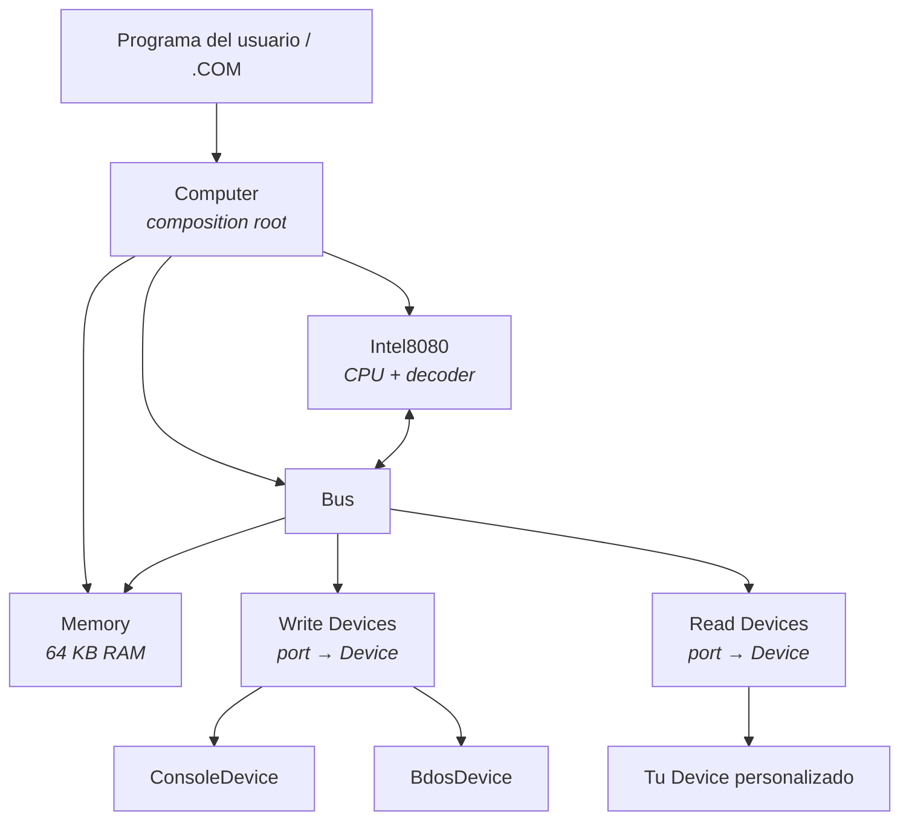
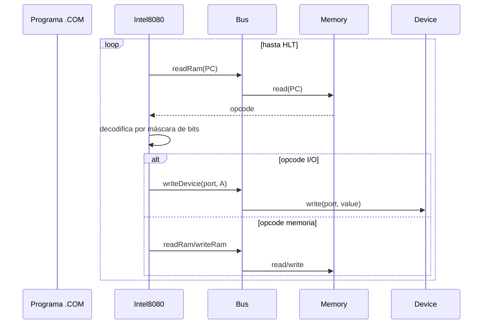

# Intel8080TS

[](https://www.typescriptlang.org/)
[](https://nodejs.org/)
[](#tests)
[](LICENSE)
[](https://pnpm.io/)

Emulador del procesador **Intel 8080** escrito en TypeScript con fines **didácticos**. Implementa el set de instrucciones oficial completo (244 opcodes), una arquitectura modular CPU/Bus/Memory/Device y un stub mínimo de CP/M BDOS que permite correr binarios `.COM` reales de diagnóstico.

El objetivo no es ser el emulador más rápido del mundo, sino el más **legible** y **didáctico** posible: cada decisión privilegia la claridad y la cercanía al hardware real sobre la optimización.

---

## Tabla de contenidos

- [Características](#características)
- [Inicio rápido](#inicio-rápido)
- [Scripts disponibles](#scripts-disponibles)
- [Arquitectura](#arquitectura)
- [Decodificación por patrones de bits](#decodificación-por-patrones-de-bits)
- [Cobertura de opcodes](#cobertura-de-opcodes)
- [Cómo extender el emulador](#cómo-extender-el-emulador)
- [Validación con CPUDIAG](#validación-con-cpudiag)
- [Tests](#tests)
- [Pila tecnológica](#pila-tecnológica)
- [Roadmap y limitaciones](#roadmap-y-limitaciones)
- [Recursos](#recursos)
- [Licencia](#licencia)

---

## Características

- **Set de instrucciones oficial completo**: 244 opcodes del Intel 8080 implementados, incluyendo DAA, XTHL, PCHL, DI/EI y RST 0-7.
- **64 KB de RAM plana** modelada con `Uint8Array`.
- **Bus de I/O** con dispositivos conectables a puertos individuales.
- **Carga de binarios `.COM`** desde disco con `loadProgramFromFile`.
- **Stub CP/M BDOS** (funciones 2 y 9) para correr ROMs de diagnóstico estándar.
- **Suite de 34 tests** unitarios e integración (`node:test`, sin dependencias).
- **Disassembler básico** integrado: cada instrucción ejecutada devuelve su mnemónico.
- **Web debugger interactivo** con panel de registros, disassembly, memoria, breakpoints y log de salida.
- **Sin dependencias en runtime**: solo `node:fs`, `node:process` y `Uint8Array`.

---

## Inicio rápido

### Requisitos

- Node.js ≥ 20
- pnpm ≥ 10

### Instalación

```bash
git clone https://github.com/<tu-usuario>/Intel8080TS.git
cd Intel8080TS
pnpm install
```

### Probar el ejemplo

```bash
pnpm run dev
```

Salida esperada:

```
A
B
```

El programa de ejemplo (`src/index.ts`) carga 9 bytes de código máquina que imprimen `'A'` y `'B'` por el puerto 1 y luego ejecutan `HLT`.

### Correr la suite de tests

```bash
pnpm test
```

### Correr un diagnóstico real

```bash
# Descarga CPUDIAG.COM en roms/ (ver roms/README.md)
pnpm run cpudiag
```

---

## Scripts disponibles

| Script                        | Descripción                                                                |
| ----------------------------- | -------------------------------------------------------------------------- |
| `pnpm run dev`                | Ejecuta `src/index.ts` con `nodemon` (recarga automática).                 |
| `pnpm run cpudiag [ruta.COM]` | Ejecuta un binario `.COM` de diagnóstico (por defecto `roms/CPUDIAG.COM`). |
| `pnpm test`                   | Corre la suite con `node:test`.                                            |
| `pnpm run typecheck`          | Verifica tipos con `tsc --noEmit`.                                         |
| `pnpm run lint`               | Ejecuta ESLint.                                                            |
| `pnpm run lint:fix`           | Aplica correcciones automáticas de ESLint.                                 |
| `pnpm run format`             | Formatea con Prettier.                                                     |
| `pnpm run format:check`       | Verifica formato sin escribir.                                             |
| `pnpm run web`                | Inicia el debugger web en `http://localhost:3000`.                         |
| `pnpm run compile-examples`   | Compila los ejemplos a `roms/examples/*.com`.                              |

---

## Web debugger

El proyecto incluye un debugger web que corre en `http://localhost:3000`:

```bash
pnpm run web
```

Características:

- Panel de **registros** y **flags** con resaltado de cambios.
- **Disassembly** con la instrucción actual marcada y breakpoints clickeables.
- Vista de **memoria** en hex/ASCII con navegación a la dirección del PC.
- **Log** separado para salida de consola (puerto `0x01`) y BDOS (puerto `0xFF`).
- Carga rápida de ROMs de diagnóstico y ejemplos desde un dropdown.
- Atajos de teclado: `S` (step), `R` (run), `Esc` (stop), `Backspace` (reset).

Los ejemplos se compilan a binarios `.com` con:

```bash
pnpm run compile-examples
```

---

## Arquitectura

El emulador se compone de cuatro piezas principales en `src/core/` más capas de aplicación en `src/`:



### Núcleo (`src/core/`)

| Archivo        | Responsabilidad                                                                                                                                                   |
| -------------- | ----------------------------------------------------------------------------------------------------------------------------------------------------------------- |
| `Intel8080.ts` | CPU: registros, flags, decodificación por patrones, dispatch de opcodes.                                                                                          |
| `Bus.ts`       | Router entre CPU, memoria y dispositivos I/O por puerto.                                                                                                          |
| `Memory.ts`    | RAM lineal de 64 KB.                                                                                                                                              |
| `Device.ts`    | Interfaz mínima `{ read(port), write(port, value) }`.                                                                                                             |
| `Computer.ts`  | Composition root: cablea CPU + Bus + Memory; expone API pública (`loadProgram`, `loadProgramFromFile`, `setStackPointer`, `setProgramCounter`, `executeProgram`). |

### Aplicaciones de ejemplo (`src/`)

| Archivo              | Descripción                                                                  |
| -------------------- | ---------------------------------------------------------------------------- |
| `index.ts`           | Entry point del ejemplo "Hello AB".                                          |
| `ExampleComputer.ts` | Conecta `ConsoleDevice` al puerto `0x01`.                                    |
| `ConsoleDevice.ts`   | Device que imprime caracteres en `stdout`.                                   |
| `CpuDiagComputer.ts` | Inyecta trampolín BDOS en `0x0005` para correr `.COM` de diagnóstico.        |
| `BdosDevice.ts`      | Stub CP/M BDOS: imprime char (función 2) y cadena `$`-terminada (función 9). |
| `cpudiag.ts`         | Entry point CLI para ejecutar diagnósticos.                                  |

### Flujo de ejecución



---

## Decodificación por patrones de bits

Este es el corazón pedagógico del proyecto. En vez de mantener una tabla de 256 entradas con un `case` por opcode, **agrupamos familias enteras de instrucciones reconociendo bits fijos dentro del byte de opcode**. Es exactamente como decodifica el silicio del 8080.

### Ejemplo: la familia `MOV destino, origen`

Los 63 opcodes `MOV r,r` ocupan el rango `0x40-0x7F` y siempre tienen el siguiente formato:

```
 7 6 5 4 3 2 1 0
┌─┬─┬─┬─┬─┬─┬─┬─┐
│0│1│ D D D │ S S S │
└─┴─┴─┴─┴─┴─┴─┴─┘
   │   │       │
   │   │       └── registro origen  (3 bits → 8 opciones)
   │   └────────── registro destino (3 bits → 8 opciones)
   └────────────── prefijo "01" identifica MOV
```

En código TypeScript se reduce a:

```ts
if (opcode >= 0x40 && opcode <= 0x7f && opcode !== 0x76) {
  const destino = (opcode >> 3) & 0x07 // extrae bits 5-3
  const origen = opcode & 0x07 // extrae bits 2-0
  this.writeRegisterOrMemory(destino, this.readRegisterOrMemory(origen))
}
```

Una rama cubre **63 opcodes**. El mapa de códigos a registros (`['B','C','D','E','H','L','M','A']`) refleja literalmente el cableado del chip.

### Las dos operaciones clave

| Operación                   | Para qué sirve                                                   |
| --------------------------- | ---------------------------------------------------------------- |
| `(opcode & MASK) === VALOR` | Verifica que los bits "fijos" de una familia coincidan.          |
| `(opcode >> N) & 0x07`      | Extrae un campo de 3 bits (registro/condición) de la posición N. |

### Ventajas frente al enfoque tabular

| Enfoque tabular ingenuo                         | Decodificación por patrones                   |
| ----------------------------------------------- | --------------------------------------------- |
| 256 entradas escritas a mano                    | ~30 ramas `if`                                |
| `MOV B,B`, `MOV B,C`, ... duplicados            | Una sola rama cubre los 63 MOV                |
| Cambiar la implementación de MOV → 63 ediciones | Un solo lugar                                 |
| No refleja el diseño físico del chip            | Refleja cómo el hardware realmente decodifica |

Toda la decodificación del proyecto sigue este patrón, distribuida en métodos `execute*Instruction` por familia.

---

## Cobertura de opcodes

| Familia                                                                                           | Opcodes | Implementada en                   |
| ------------------------------------------------------------------------------------------------- | ------: | --------------------------------- |
| Transferencia (`MOV`, `MVI`, `LXI`)                                                               |      75 | `executeTransferInstruction`      |
| ALU (`ADD/ADC/SUB/SBB/ANA/XRA/ORA/CMP`, `INR/DCR`, inmediatos)                                    |      88 | `executeAluInstruction`           |
| Control de flujo (`JMP`, `Jcc`)                                                                   |       9 | `executeControlFlowInstruction`   |
| Pila (`PUSH`, `POP`)                                                                              |       8 | `executeStackInstruction`         |
| Subrutina (`CALL`, `RET`, `Ccc`, `Rcc`, `RST 0-7`)                                                |      26 | `executeSubroutineInstruction`    |
| Rotación y flags (`RLC`, `RRC`, `RAL`, `RAR`, `STC`, `CMC`)                                       |       6 | `executeRotateInstruction`        |
| Memoria/pares (`INX`, `DCX`, `DAD`, `XCHG`, `SPHL`, `LDA`, `STA`, `LHLD`, `SHLD`, `LDAX`, `STAX`) |      22 | `executeMemoryAndPairInstruction` |
| Misceláneos (`NOP`, `HLT`, `IN`, `OUT`, `DAA`, `CMA`, `XTHL`, `PCHL`, `DI`, `EI`)                 |      10 | `executeMiscInstruction`          |
| **Total**                                                                                         | **244** |                                   |

### Opcodes no soportados

Los 12 opcodes **indocumentados** del 8080 lanzan `Opcode no soportado` en runtime:

```
0x08  0x10  0x18  0x20  0x28  0x30  0x38
0xCB  0xD9  0xDD  0xED  0xFD
```

En el 8080 real, estos son alias de `NOP`, `JMP`, `CALL` y `RET`. Ningún programa bien escrito los usa.

---

## Cómo extender el emulador

### 1. Conectar un dispositivo I/O propio

Cualquier objeto que implemente la interfaz `Device` puede engancharse a un puerto:

```ts
import { Device } from './core/Device'
import { Computer } from './core/Computer'

class LedDevice implements Device {
  read(port: number): number {
    throw new Error(`LED no soporta lectura en puerto ${port}`)
  }

  write(port: number, value: number): void {
    console.log(`LED #${port}: ${value.toString(2).padStart(8, '0')}`)
  }
}

const computer = new Computer()
computer.bus.connectDeviceToWritePort(0x10, new LedDevice())
```

Ahora cualquier instrucción `OUT 0x10` invocará tu `LedDevice.write`.

### 2. Cargar y correr un programa propio

```ts
import { Computer } from './core/Computer'

const computer = new Computer()

// MVI A,0x42 ; OUT 0x01 ; HLT
const program = [0x3e, 0x42, 0xd3, 0x01, 0x76]

computer.loadProgram(program, 0x0000)
computer.setStackPointer(0xf000)
computer.executeProgram()
```

### 3. Correr un binario `.COM` de CP/M

```ts
import { CpuDiagComputer } from './CpuDiagComputer'

const computer = new CpuDiagComputer()
computer.runDiagnostic('roms/CPUDIAG.COM')
```

### 4. Añadir un opcode nuevo

Identifica la familia del opcode y agrega una rama en el método `execute*Instruction` correspondiente. Por ejemplo, para añadir un hipotético `XYZ` con patrón fijo `11_xx_x101`:

```ts
if ((opcode & 0xc7) === 0xc5) {
  // tu lógica aquí
  return { Disassemble: 'XYZ', Ticks: 4 }
}
```

**No reintroduzcas tablas grandes** — eso rompería el estilo unificado de decodificación.

---

## Validación con CPUDIAG

**CPUDIAG.COM** (Microcosm Associates, 1980) es el programa de diagnóstico estándar para validar emuladores 8080. Verifica el set de instrucciones e imprime un veredicto.

### Setup

1. Descarga `CPUDIAG.COM` (~2 KB) — ver `roms/README.md` para fuentes.
2. Colócalo en `roms/CPUDIAG.COM`.
3. Ejecuta:

```bash
pnpm run cpudiag
```

### Salida esperada

```
MICROCOSM ASSOCIATES 8080/8085 CPU DIAGNOSTIC
 VERSION 1.0  (C) 1980

 CPU IS OPERATIONAL
```

### Cómo funciona el stub BDOS

`CpuDiagComputer` inyecta en RAM:

- `0x0000`: `HLT` (vector de warm boot — detiene el emulador si el programa retorna a 0).
- `0x0005`: `OUT 0xFF ; RET` (entrada BDOS — todas las llamadas se redirigen al puerto `0xFF`).

`BdosDevice` está conectado al puerto `0xFF` y, al recibir un write, inspecciona los registros del CPU:

- Si `C == 2`: imprime el carácter en el registro `E`.
- Si `C == 9`: imprime la cadena `$`-terminada apuntada por `DE`.

Es suficiente para CPUDIAG, TST8080 y la mayoría de diagnósticos de la era CP/M.

### Otros diagnósticos compatibles

```bash
pnpm run cpudiag roms/TST8080.COM
pnpm run cpudiag roms/8080PRE.COM
pnpm run cpudiag roms/8080EXM.COM   # exhaustivo, tarda minutos
```

---

## Tests

La suite usa `node:test` (incluido en Node.js, sin dependencias). Se compila a `.tmp-test/` antes de ejecutarse.

```bash
pnpm test
```

Cobertura actual: **34 tests** distribuidos en:

| Archivo                                | Foco                                   |
| -------------------------------------- | -------------------------------------- |
| `alu-instructions.test.ts`             | ADD/ADC/SUB/SBB/INR/DCR/lógicas.       |
| `extended-alu-instructions.test.ts`    | Inmediatos (ADI/SUI/ANI/...).          |
| `alu-program.integration.test.ts`      | Programa ALU completo.                 |
| `transfer-instructions.test.ts`        | MOV/MVI/LXI.                           |
| `jump-instructions.test.ts`            | JMP/Jcc.                               |
| `jump-program.integration.test.ts`     | Programa con saltos.                   |
| `subroutine-instructions.test.ts`      | CALL/RET/Ccc/Rcc.                      |
| `stack-instructions.test.ts`           | PUSH/POP.                              |
| `stack-subroutine.integration.test.ts` | Stack + subrutinas integradas.         |
| `memory-pair-instructions.test.ts`     | INX/DCX/DAD/XCHG/LDA/STA/LHLD/SHLD.    |
| `rotate-conditional-psw.test.ts`       | RLC/RRC/RAL/RAR + PSW.                 |
| `io-instructions.test.ts`              | IN/OUT.                                |
| `pc-start-address.test.ts`             | Punto de entrada configurable.         |
| `unconnected-port.test.ts`             | Manejo de puertos no conectados.       |
| `unsupported-opcode.test.ts`           | Error claro en opcodes indocumentados. |

---

## Pila tecnológica

- **TypeScript 5.6** — tipado estricto.
- **Node.js ≥ 20** — runtime y test runner (`node:test`).
- **pnpm 10** — gestor de paquetes.
- **ts-node + nodemon** — desarrollo.
- **ESLint + Prettier** — estilo y formato.
- **Sin dependencias de producción** — solo módulos nativos de Node.

---

## Roadmap y limitaciones

### Implementado

- Set de instrucciones oficial 8080 completo (244 opcodes).
- Memoria 64 KB, bus I/O, devices.
- Carga de binarios `.COM`.
- Stub CP/M BDOS (funciones 2 y 9).

### No implementado (futuro)

- **Interrupciones reales**: existe el flag `interruptsEnabled` pero no se procesan IRQs ni vectores. Necesario para Space Invaders y arcades de la era.
- **Opcodes indocumentados**: los 12 alias documentados arriba lanzan error.
- **Timing real**: cada instrucción devuelve sus `Ticks` pero el bucle no respeta tiempos. Útil para emuladores precisos a ciclo.
- **Periféricos avanzados**: no hay framebuffer, teclado, disco, sonido. La interfaz `Device` permite añadirlos.
- **BDOS completo**: solo funciones 2 y 9. No hay FCB, no hay sistema de archivos CP/M.

---

## Recursos

### Documentación oficial

- [Intel 8080 Assembly Language Programming Manual (1975)](https://archive.org/details/Intel_8080_Assembly_Language_Programming_Manual)
- [Intel 8080 Microcomputer Systems User's Manual](https://archive.org/details/bitsavers_intel80808emSep75_2073538)

### Tutoriales y referencias

- [emulator101.com](http://www.emulator101.com/) — Tutorial clásico de emulación 8080.
- [pastraiser.com - Intel 8080 Opcodes](https://pastraiser.com/cpu/i8080/i8080_opcodes.html) — Tabla visual de opcodes.
- [Wikipedia: Intel 8080](https://en.wikipedia.org/wiki/Intel_8080)

### ROMs de diagnóstico

- [Altair Clone — CPU Tests](https://altairclone.com/downloads/cpu_tests/)

---

## Licencia

Este proyecto está bajo licencia [MIT](LICENSE). Eres libre de usarlo, modificarlo y distribuirlo, incluso comercialmente, siempre que conserves el aviso de copyright.

---

> Hecho con fines didácticos. Si te resulta útil para aprender cómo funciona un CPU por dentro, ese era el plan.
